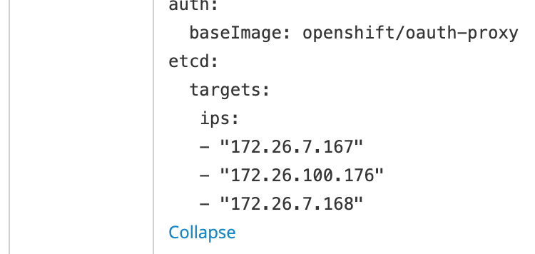
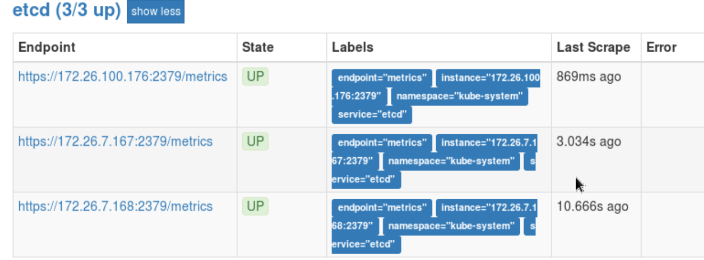
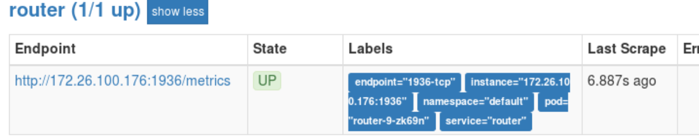
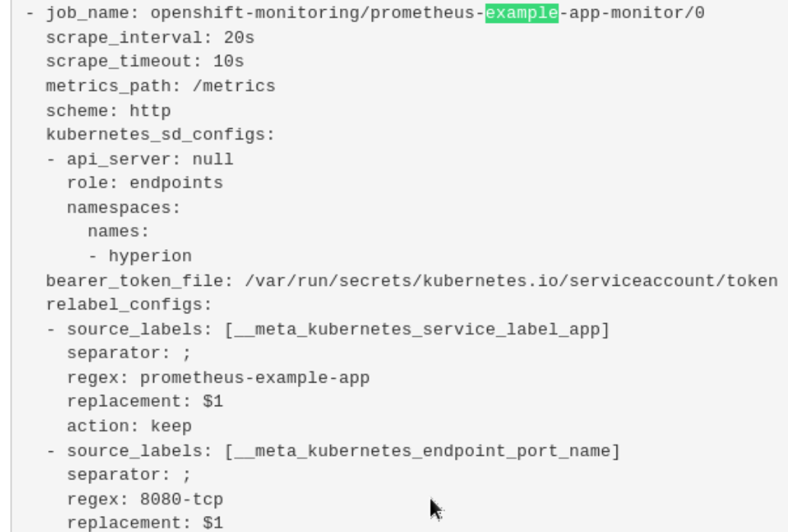
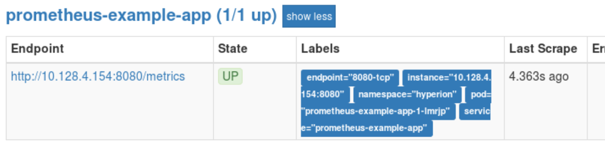
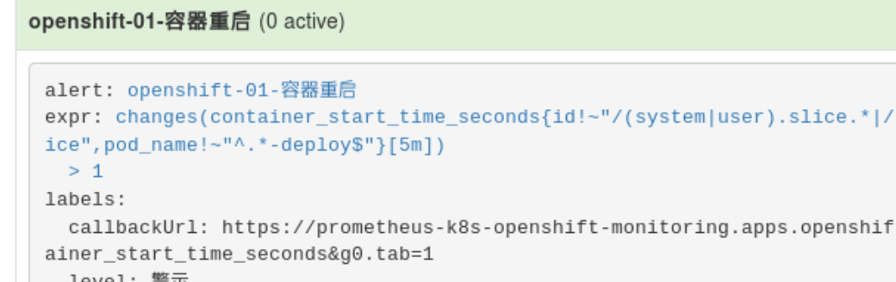
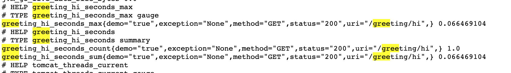
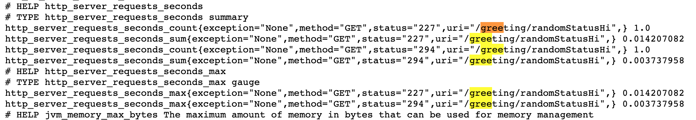

## 监控模块

Openshift v3.11 集群监控以operator的形式把prometheus, grafana, alertmanager集中管理起来.
然而,当cluster monitor operator作为最高管理者,只开放了部分api对象修改, 这就造成了二次定制开发的巨大限制.
比如我要为grafana增加volumeClaim, 直接修改deployment spec是不行的, 因为operator侦测到对象变化,
硬是又给你再改回来. 而operator层面没有把这个对象参数化, 并不提供修改的渠道. 实在是 ...

promethues只能使用storageClass作为存储对象接口, 为了支持方便的NFS, 这里需要进行一些改造.
另外grafana 暂时也只能使用empty dir作为存储, 它的插件更新无法持久化.

### 安装步骤
- 配置NFS Server （node02-inner）

~~~
    # vi /etc/exports
    /diskb/export/prometheus-001 172.26.7.0/8(rw,sync,all_squash)
    /diskb/export/prometheus-002 172.26.7.0/8(rw,sync,all_squash)
    /diskb/export/alertmanager-001 172.26.7.0/8(rw,sync,all_squash)
    /diskb/export/alertmanager-002 172.26.7.0/8(rw,sync,all_squash)
    /diskb/export/alertmanager-003 172.26.7.0/8(rw,sync,all_squash)
    /diskb/export/grafana-001 172.26.7.0/8(rw,sync,all_squash)
    
    # systemct restart nfs
    # iptables -A OS_FIREWALL_ALLOW -p tcp -m state --state NEW -m tcp --dport 2049 -j ACCEPT
~~~

- 为monitor节点打上label

~~~
    # oc label node node01-inner region/monitor=true
    # oc label node node02-inner region/monitor=true
~~~

- 修改ansible hosts文件, 增加相关配置选项. 这里定义了storage_class_name是不存在的, 目的是为了后继修改方便.

~~~
    # vi /etc/ansible/hosts

    # 安装Prometheus operator
    #
    # Cluster monitoring is enabled by default, disable it by setting
    openshift_cluster_monitoring_operator_install=true
    #
    # Cluster monitoring configuration variables allow setting the amount of
    # storage and storageclass requested through PersistentVolumeClaims.
    #
    openshift_cluster_monitoring_operator_prometheus_storage_enabled=true
    openshift_cluster_monitoring_operator_alertmanager_storage_enabled=true
    
    openshift_cluster_monitoring_operator_prometheus_storage_capacity="2Gi"
    openshift_cluster_monitoring_operator_alertmanager_storage_capacity="1Gi"
    
    openshift_cluster_monitoring_operator_node_selector={'region/monitor':'true'}
    
    # external NFS support refer to Using Storage Classes for Existing Legacy Storage
    openshift_cluster_monitoring_operator_prometheus_storage_class_name="nfs"
    openshift_cluster_monitoring_operator_alertmanager_storage_class_name="nfs"
~~~

- 修改以下playbook operator config template文件, 这是让prometheus使用NFS的一个hack

~~~
    # vi roles/openshift_cluster_monitoring_operator/templates/cluster-monitoring-operator-config.j2
    
    Line 28
    
      volumeClaimTemplate:
        spec:
          selector:
            matchLabels:
              volume/type: pv-prometheus
          resources:
            requests:
              storage: {{ openshift_cluster_monitoring_operator_prometheus_storage_capacity }}
    

    Line 46
    
          volumeClaimTemplate:
            spec:
              selector:
                matchLabels:
                  volume/type: pv-alertmanager
              resources:
                requests:
                  storage: {{ openshift_cluster_monitoring_operator_alertmanager_storage_capacity }}
    
~~~

- 创建alertmanager, promethues, grafana pv/pvc

~~~
    # oc create -f prometheus-pv-nfs-001.yml
    # oc create -f prometheus-pv-nfs-002.yml
    # oc create -f grafana-pv-pvc-nfs.yml
~~~

- 执行安装

~~~
    # ansible-playbook playbooks/openshift-monitoring/config.yml
~~~

- 访问promehteus 入口页面 https://grafana-openshift-monitoring.apps.openshift.net.cn

---
### 配置etcd监控目标
不管etcd是安装在哪里, 配置要做的事情是在prometheus 配置里增加scrape target, 把etcd client证书挂载进prometheus,
让prometheus可读取. 

但是在operator的框架下, 只开放很少一部分的可配置功能, etcd监控就是其中之一. 本来简单的改scrape taget的事情, 
需要修改clustr monitor config, 由cluster operator去增加etcd ServiceMonitor对象, 同步到secret/prometheus-k8s,
promethues pod 内部的prometheus-config-reloader检测到文件变化,再生成真正的配置给prometheus.

配置同步链条太长, 大大增加了定制化的困难, 减低配置的灵活度.

[参考文档](https://docs.openshift.com/container-platform/3.11/install_config/prometheus_cluster_monitoring.html#configuring-etcd-monitoring)

- 修改ConfigMap cluster-monitoring-config, 增加etcd监控target ip地址

- 创建包含etcd client证书的文件 etcd-cert-secret.yaml

~~~
    # cat <<-EOF > etcd-cert-secret.yaml
    apiVersion: v1
    data:
      etcd-client-ca.crt: "$(cat /etc/origin/master/master.etcd-ca.crt | base64 --wrap=0)"
      etcd-client.crt: "$(cat /etc/origin/master/master.etcd-client.crt | base64 --wrap=0)"
      etcd-client.key: "$(cat /etc/origin/master/master.etcd-client.key | base64 --wrap=0)"
    kind: Secret
    metadata:
      name: kube-etcd-client-certs
      namespace: openshift-monitoring
    type: Opaque
    EOF
~~~

- 创建新的secret对象

~~~
    # oc apply -f etcd-cert-secret.yaml
~~~

- 理论上新增scrape taget后, prometheus会帮你重启生效配置. 如果不生效,则手动重启.

~~~
    # oc scale statefulset prometheus-k8s --replicas=0
    # oc scale statefulset prometheus-k8s --replicas=2
~~~

---
### 配置监控Router
Router的监控端口是1936, 以Basic Auth验证请求. 所以在ServiceMonitor中需要配置以下信息.

- 获取Router的Basic Auth用户与密码

~~~
    # oc export dc router -n default |grep -A 1 STATS
        - name: STATS_PASSWORD
          value: wDMpjeGV1P
        - name: STATS_PORT
          value: "1936"
        - name: STATS_USERNAME
          value: admin
~~~

- 把用户名密码转成base64编码

~~~
    # echo 'admin' |base64
    YWRtaW4K
    # echo 'wDMpjeGV1P' |base64
    d0RNcGplR1YxUAo=
~~~

- 创建 router basic auth secret和Service Monitor

~~~
    # oc project openshift-monitoring
    # oc create -f router-basic-auth-secret.yml
    # oc create -f router-monitor.yml
~~~

---
### 配置监控第三方应用的例子
以下步骤演示如何监控一个go语言应用, 开放监控端口为8080, 路径为/metrics. 
代码参考openshift cluster mornitoring的仓库.

- 部署应用模板

~~~
    # oc create -f prometheus-example-app-template.yml -n hyperion
~~~

- 注入环境变量,使用模板创建应用,服务,路由

~~~
    # oc process prometheus-example-app-template -p ENV=test |oc create -f -
    # oc get dc
    NAME                     REVISION   DESIRED   CURRENT   TRIGGERED BY
    prometheus-example-app   1          1         1         config
    # oc get svc
    NAME                      TYPE        CLUSTER-IP      EXTERNAL-IP   PORT(S)            AGE
    prometheus-example-app    ClusterIP   172.30.8.240    <none>        8080/TCP           19m
~~~

- 修改应用所在的namespace label, 允许被监控

~~~
    # oc patch namespace hyperion -p '{"metadata": {"labels": {"openshift.io/cluster-monitoring": "true"}}}'
~~~

- 为prometheus-k8s sa增加允许访问项目内对象（主要是为了service）的权限

~~~
    # oc adm policy add-role-to-user view system:serviceaccount:openshift-monitoring:prometheus-k8s -n hyperion
~~~

- 为应用创建ServiceMonitor对象.
*注意: endpoints下的port值与对应service下的port name一致*

~~~
    # oc create -f sericemonitor-prometheus-example-app.yml -n openshift-monitoring
~~~

- 配置成功后, 可以看到应用的监控配置与目标对象

---
### 配置告警规则
告警规则的定客户化是通过添加prometheusrules CRD来实现的, 每新增一个CRD, 相应在cm/prometheus-k8s-rulefiles-0
增加一个group, 并自动完成prometheus 的reload. 所以运维人员可以通过管理这些CRD, 很轻松的管理告警规则与分组.

- 准备好告警规则配置文件, 注意kind为PrometheusRule, 例如

~~~
    apiVersion: monitoring.coreos.com/v1
    kind: PrometheusRule
    metadata:
      labels:
        prometheus: k8s
        role: alert-rules
      name: prometheus-openshift-rules
      namespace: openshift-monitoring
    spec:
      groups:
      - name: 'Openshift 云平台告警'
        rules:
        - alert: 'openshift-01-容器重启'
          expr: changes(container_start_time_seconds{id!~"/(system|user).slice.*|/kubepods.slice/kubepods-burstable.slice/.*.slice", pod_name!~"^.*-deploy$"}[5m]) > 1
          labels:
            level: '警示'
            callbackUrl: 'https://prometheus-k8s-openshift-monitoring.apps.openshift.net.cn/graph?g0.range_input=1h&g0.expr=container_start_time_seconds&g0.tab=1'
          annotations:
            description: '{{ $labels.instance }}实例在过去5分钟内出现容器重启的现象'
~~~

- 创建新的 prometheusrules对象

~~~
    # oc create -f alert-rules/prometheusrules-openshift.yml
~~~

- 后继自动触发规则注入, 重启prometheus.

### 业务应用集成Prometheus监控
下面以一个spring boot 2项目为例子, 展示如何使用actuator和micrometer为应用接入prometheus监控体系.

- 修改 _pom.xml_ , 增加包依赖

~~~
        <dependency>
            <groupId>org.springframework.boot</groupId>
            <artifactId>spring-boot-starter-actuator</artifactId>
        </dependency>
        <dependency>
            <groupId>io.micrometer</groupId>
            <artifactId>micrometer-registry-prometheus</artifactId>
            <version>1.0.4</version>
        </dependency>
~~~

- 修改resource/application-dev.property, 开放prometheus监控子路径

~~~
    management.endpoints.web.exposure.include=health,info,metrics,prometheus
    management.endpoint.prometheus.enabled=true
    management.metrics.web.server.auto-time-requests=true
    management.metrics.export.prometheus.enabled=true
    management.security.enabled=false
~~~

- 在Controller.java中, 导入依赖包. 

~~~
    import java.util.concurrent.atomic.AtomicInteger;
    
    import io.micrometer.core.annotation.Timed;
    import io.micrometer.core.instrument.Meter;
    import io.micrometer.core.instrument.Counter;
    import io.micrometer.core.instrument.MeterRegistry;
~~~

- 通用方法: 为每个api加上@Timed注解, 用于收集时间类计数, 如总次数, 平均每秒次数, 最大平均每秒次数.
另外也可设置标签, 直方图统计(histogram)等属性.

~~~
    @ApiOperation(value="正常Hi", notes="参数：name")
    @RequestMapping("/hi")
    @Timed( value = "greeting_hi",
            histogram = false,
            extraTags = {"demo", "true"}
    )
    public String hi() {
        return "Hi!";
    }
~~~

- 如果需要自定义统计信息, 则通过 _MetricRegistry_ 构造计数器(counter)或者度量器(gauge).
在业务函数方法中增加计数器/度量器调用.

~~~
    Counter myCounter;
    AtomicInteger myGauge;
    
    public GreetingController(MeterRegistry registry){
        // 注册名字为 my_counter 计数器衡量 /hi api
        this.myCounter = registry.counter("my_counter"); 
        // 注册名字为 my_gauge 度量器用于计算 myGauge对象的长度
        this.myGauge = registry.gauge("my_gauge", new AtomicInteger(0));
    }
    
    @ApiOperation(value="正常Hi", notes="参数：name")
    @RequestMapping("/hi")
    public String hi() {
        // 增加计数对象值 myCounter
        this.myCounter.increment();
        return "Hi!";
    }
    
    @ApiOperation(value="随机返回码Hi", notes="")
    @GetMapping(value = "/randomStatusHi")
    public ResponseEntity<String> randomStatusHi() {
        int code = new Random().nextInt(100);
        Integer result = randomStatus + code;
        // 增加返回配置的状态码的概率
        if (code % 10 == 0) {
            result = randomStatus;
        }
        // 设置度量对象myGauge
        this.myGauge.set(code);
        return ResponseEntity.status(result).body("Random Status " + String.valueOf(result) + " Hi!");
    }
~~~

- Maven构建, 执行jar包, 使spring boot RestController跑起来

~~~
    # mvn clean package
    # java -jar target/gs-rest-service-0.1.0.jar --spring.profiles.active=dev
~~~

- 访问api /greeting/hi, /greeting/randomStatusHi, 模拟外部请求

~~~
    # curl http://localhost:8800/greeting/hi
    # curl http://localhost:8800/greeting/randomStatusHi
~~~

- 检查prometheus metrics有关以上两个api的统计信息: _http://localhost:8800/actuator/prometheus_

